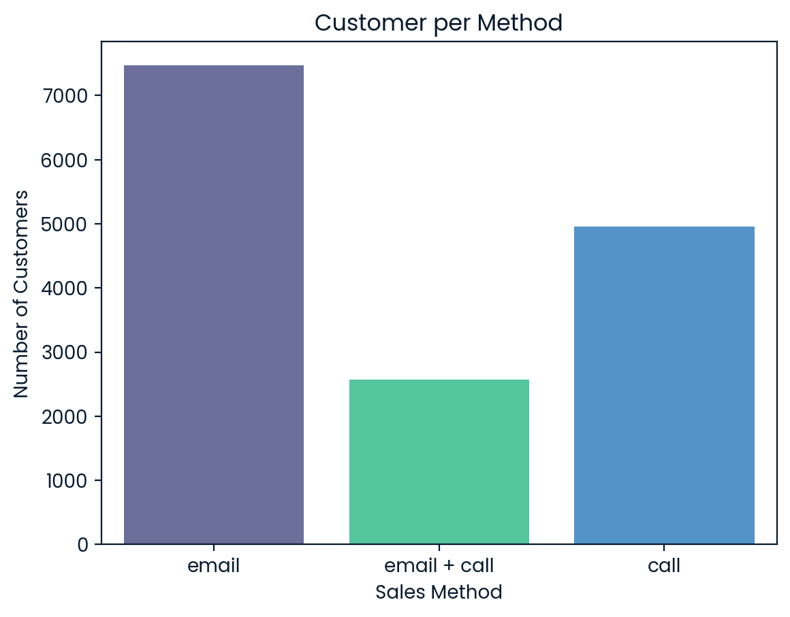
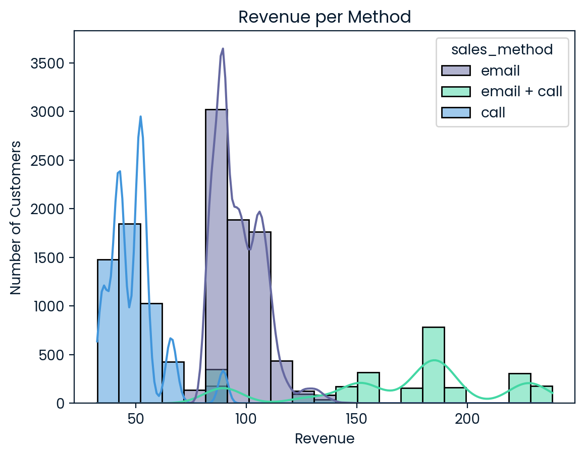
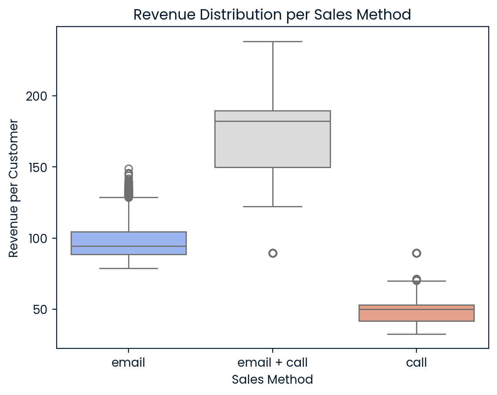
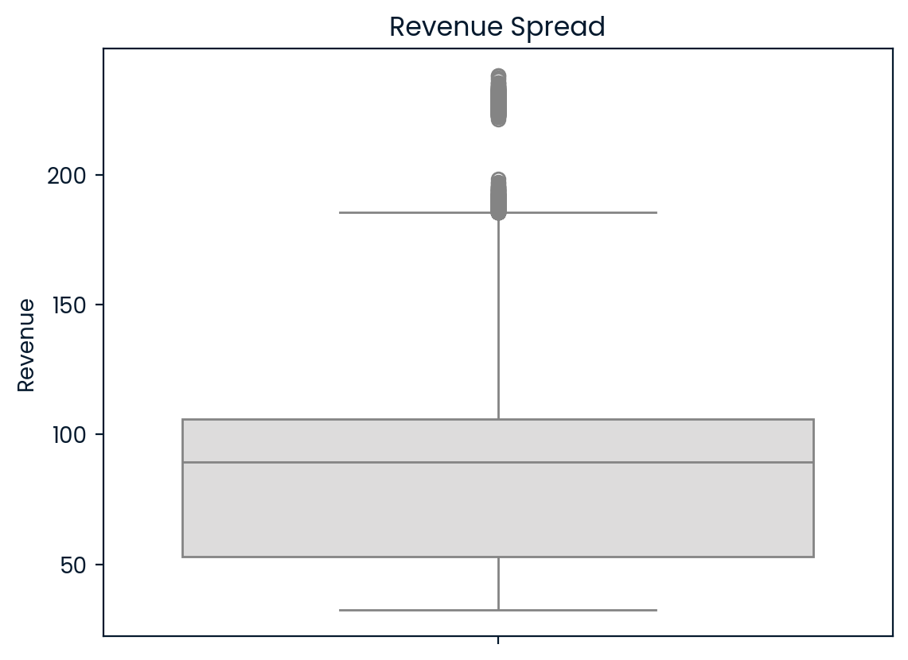
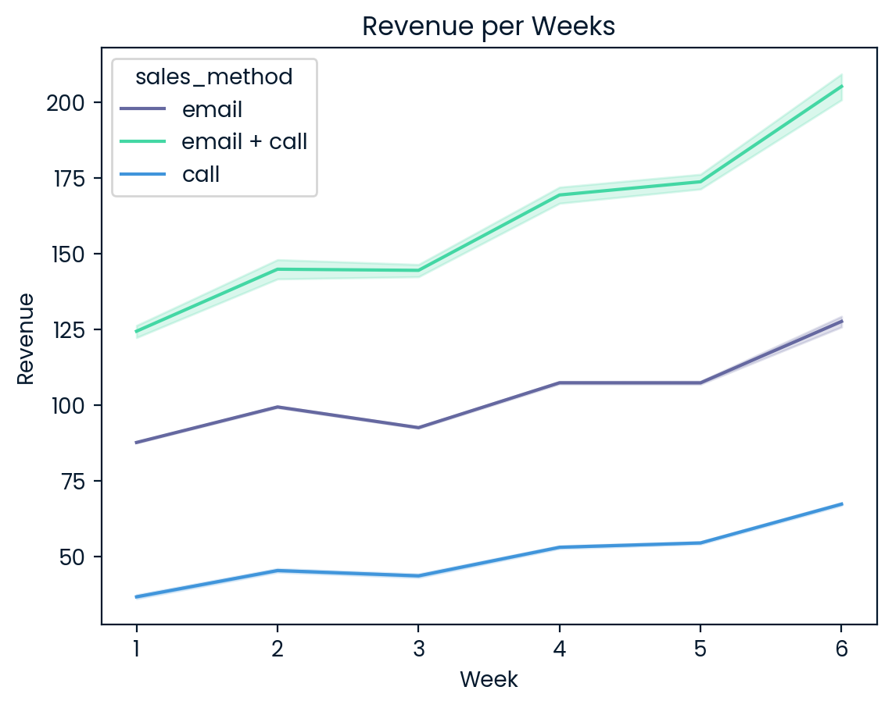
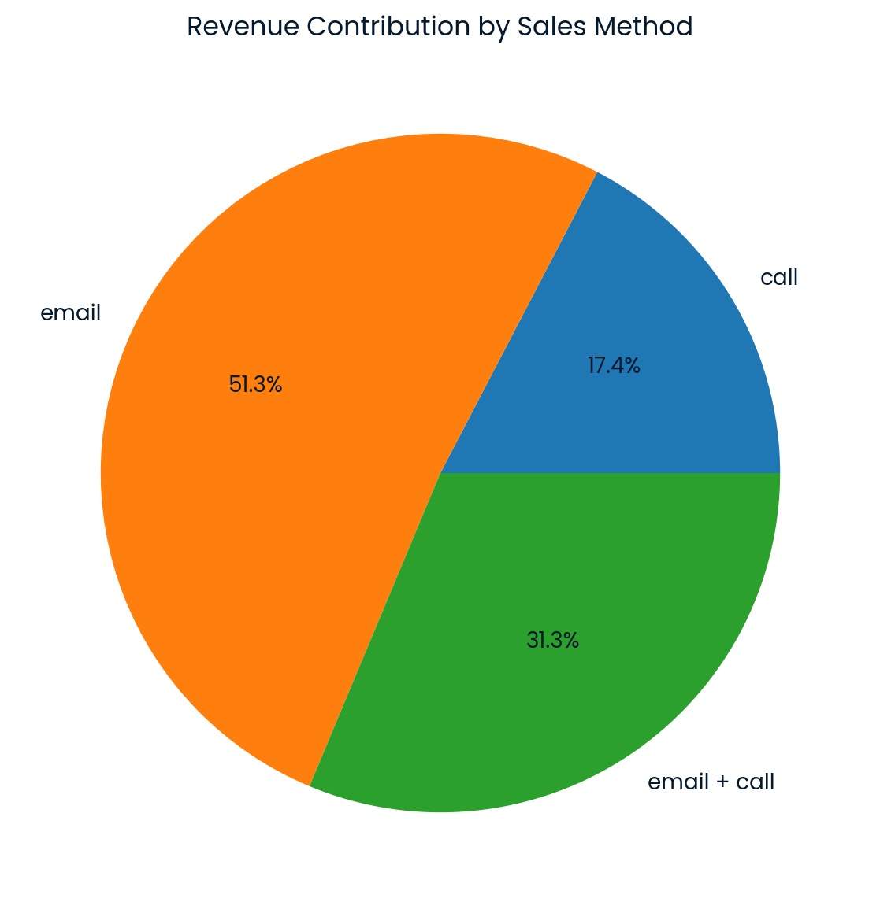

# Product Sales Analysis Report

This repository provides a comprehensive analysis of product sales data, covering data cleaning, visualization, and business insights to support strategic decision-making.

---

## Repository Structure

```
product-sales-analysis/
├── data/
│   └── product_sales.csv
├── plots/
│   ├── customer_per_method.png
│   ├── Revenue_per_method.png
│   ├── Revenue_distribution_per_method.png
│   ├── revenue_dist.png
│   ├── revenue_spread.png
│   ├── Revenue_per_week.png
│   └── Revenue_contribution_pie.png
├── src/
│   ├── data_cleaning.py
│   ├── data_analysis.py
│   ├── data_visualization.py
│   └── __init__.py
├── notebooks/
│   └── exploratory_analysis.ipynb
├── .gitignore
├── LICENSE
├── main.py
├── requirements.txt
└── README.md
```

- **`data/`**: Contains the original data file.
- **`src/`**: Python modules used for cleaning, analyzing, and visualizing data.
- **`notebooks/`**: Jupyter notebooks for exploratory analysis.
- **`main.py`**: The main script to execute the analysis workflow.
- **`requirements.txt`**: Lists all dependencies needed to run the project.
- **`LICENSE`**: MIT License for open usage.

---

## Installation & Setup

Follow these steps to set up and run the analysis locally:

### Step 1: Clone the repository
```bash
git clone <repository-link>
cd product-sales-analysis
```

### Step 2: Install dependencies
```bash
pip install -r requirements.txt
```

### Step 3: Run the analysis
```bash
python main.py
```

This script will load, clean, analyze, and visualize the dataset.

---

## Data Validation & Cleaning

The dataset was validated and cleaned to ensure accurate analysis:

| Column              | Validation & Cleaning Steps                                          |
|---------------------|----------------------------------------------------------------------|
| **week**            | Checked for missing values (Clean).                                  |
| **sales_method**    | Standardized entries; replaced `"em +"` with `"email +"`.            |
| **customer_id**     | Ensured uniqueness (no duplicates).                                  |
| **nb_sold**         | Checked for missing values (Clean).                                  |
| **revenue**         | Median imputation (due to left-skewed distribution).                 |
| **years_as_customer**| Replaced outliers (values above 41) with median.                    |
| **nb_site_visits**  | Checked for missing values (Clean).                                  |
| **state**           | Checked for category consistency (Clean).                            |

Dataset status: ✅ **Cleaned and ready for analysis.**

---

## Exploratory Data Analysis (EDA)

### Customer Count per Sales Method
- **Email**: 7,466 customers  
- **Call**: 4,962 customers  
- **Email + Call**: 2,572 customers (Highest revenue per customer)

**Visualization:**  


---

### Revenue Distribution Analysis
- Revenue is **left-skewed**, with outliers significantly impacting averages.
- Revenue typically ranges between **50 to 125**.
- Median used to impute missing values due to skewness.

**Visualizations:**  
  


**Additional Revenue Insights:**
- Multiple peaks indicate various customer segments.
- Revenue mostly concentrated below **150**.

**Revenue Spread (Boxplot):**  


---

### Revenue Over Time
- Revenue growth is consistent across all methods.
- **Email + Call** shows highest growth.
- **Call-only** has lowest growth rate.

**Visualization:**  


---

### Revenue Contribution by Method
- **Email:** 51.3% total revenue
- **Email + Call:** 31.3%
- **Call-only:** 17.4%

**Visualization (Pie Chart):**  


---

## Key Metric: Average Revenue per Customer

Calculated as:

```plaintext
Average Revenue per Customer = Total Revenue / Total Customers
```

**Current Value:** **93.62**

Monitor weekly/monthly for significant changes and trends.

---

## Recommendations

1. ✅ Prioritize **"Email + Call"** for high-value customers.
2. ✅ Use **"Email-only"** for broader, efficient outreach.
3. ❌ Minimize **"Call-only"** (low revenue and resource-intensive).

These steps will optimize resources and maximize revenue potential.

---

## Next Steps

- 📊 Develop a real-time dashboard to track sales performance.
- 🔍 Review sales strategies periodically (every 6 weeks).
- ✉️ Test personalized email campaigns to boost customer engagement.

---

## Contributing

Contributions are welcome:

1. Fork this repository.
2. Create your feature branch (`git checkout -b feature/YourFeature`).
3. Commit changes (`git commit -m 'Add YourFeature'`).
4. Push to branch (`git push origin feature/YourFeature`).
5. Open a pull request.

---

## License

This project is licensed under the [MIT License](LICENSE).

